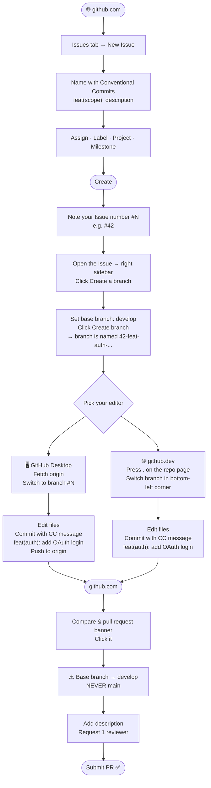

# Contributing Guide

This project uses **Trunk Based Development (TBD)** with a 1-week sprint cycle.
All work flows through GitHub Issues → feature branches → `develop` → `main`.

---

## Branch Architecture

### Branch Flow


| Branch | Direct Commits | Updated Via | When |
|--------|:--------------:|-------------|------|
| `main` | ❌ Locked | PR from `develop` — **Scrum Master only** | End of sprint · triggers Release tag |
| `develop` | ❌ Never | PR from feature branches | Each completed Issue |
| `#N-issue-name` | ✅ Your work | Created through GitHub Issues | One branch per Issue |

---

### GitHub Web Workflow (GUI developers)



---

## Part 1 — Starting New Work

> **Do not fork. Do not commit directly to `develop` or `main`.
> Every piece of work starts with a GitHub Issue.**

### 1. Create an Issue

1. Go to **GitHub Issues** → click **New Issue**
2. Name it using [Conventional Commits](#conventional-commits-cheat-sheet) format:
   ```
   feat(auth): add Google OAuth login
   fix(game): correct timer overflow on round end
   docs(readme): update local setup instructions
   ```
3. **Assign** yourself or the responsible person
4. **Choose a Label** — GitHub may auto-detect it from the issue name; adjust if not
5. Set the **Project** and **Milestone**
6. Click **Create**

> You will now see an issue number — e.g. **`#42`**. Keep it in mind; you will use it next.

---

### 2. Create the Branch

1. Open the Issue you just created
2. Click **Create a branch** (right sidebar)
3. Set the base branch to **`develop`** → click **Create branch**

GitHub auto-names your branch using the issue number as a prefix:
```
42-feat-auth-add-google-oauth-login
```

4. Back in your terminal, pull the new branch:
```bash
git pull
```
5. Switch to it using the issue number `#` for TAB autocomplete:
```bash
git switch 42<TAB>
# autocompletes → git switch 42-feat-auth-add-google-oauth-login
```
Press **Enter**. You are ready to work. 🚀

---

## Part 2 — Submitting Your Work

### 3. Commit Your Changes

Stage only the files you changed:
```bash
git add src/auth/oauth.py
git add tests/auth/test_oauth.py
```

Commit using Conventional Commits format:
```bash
git commit -m "feat(auth): add Google OAuth login"
```

Optionally, append `#N` to cross-link the commit to the Issue on GitHub:
```bash
git commit -m "feat(auth): add Google OAuth login #42"
```

### Closing Keywords — Closes, Fixes, Resolves

These keywords tell GitHub to **automatically close the Issue** when the PR is merged.
They are all equivalent — use whichever reads more naturally for the issue type:

| Keyword | Typical use |
|---------|-------------|
| `Closes` | Feature requests, tasks |
| `Fixes` | Bug reports |
| `Resolves` | General issues, ambiguous type |

**The keyword must go in the commit body, not the subject line.**
Use a second `-m` flag — git treats each `-m` as a separate paragraph:

```bash
# ✅ Correct — subject and body are separate -m flags
git commit -m "feat(auth): add Google OAuth login" -m "Closes #42"

# ❌ Wrong — keyword mixed into the subject line
git commit -m "feat(auth): add Google OAuth login Closes #42"
```

Multiple issues in one commit:
```bash
git commit -m "feat(auth): add Google OAuth login" -m "Closes #42, #43"
```

Push to your feature branch:
```bash
git push
```

---

### 4. Open a Pull Request

1. Go to GitHub — you will see a **Compare & pull request** banner → click it
2. ⚠️ **Always set the base branch to `develop`** — never to `main`
3. Write a short description of what you did and why
4. Request **at least 1 reviewer** — choose someone familiar with the issue or who asked for the feature
5. Submit the PR

Once approved and merged, the branch is automatically deleted. ✅

---

## Conventional Commits Cheat-Sheet

**Format**: `type(scope): short description`

| Field | Details |
|-------|---------|
| `type` | What kind of change (see table below) |
| `scope` | Affected area in parentheses — e.g. `auth`, `game`, `api`, `frontend` *(optional but recommended)* |
| `description` | Imperative, lowercase, no trailing period — *"add login"* not *"Added login."* |

| Type | When to use | Example |
|------|-------------|---------|
| `feat` | New feature | `feat(game): add spectator mode` |
| `fix` | Bug fix | `fix(auth): correct token expiration check` |
| `docs` | Documentation only | `docs(readme): update local setup steps` |
| `refactor` | Code change, no feature or bug fix | `refactor(api): simplify user endpoint logic` |
| `test` | Adding or fixing tests | `test(game): add tournament bracket edge cases` |
| `chore` | Build, dependencies, tooling | `chore(deps): upgrade Django to 5.1` |
| `ci` | CI/CD pipeline changes | `ci: add lint step to GitHub Actions` |
| `perf` | Performance improvement | `perf(db): add index on user_id column` |
| `style` | Formatting, no logic change | `style(frontend): fix indentation in login form` |
| `revert` | Revert a previous commit | `revert: feat(game): add spectator mode` |

**Breaking change** — append `!` after the type:
```
feat!: remove legacy v1 API endpoints
```

---

## Sprint & Release Rhythm

| When | Who | Action |
|------|-----|--------|
| Mon – Fri (sprint) | Everyone | Create Issues → work on branches → open PRs → merge to `develop` |
| End of sprint (Friday) | **Scrum Master** | Review `develop` → open PR to `main` → merge → tag release `v1.X.0` |
| After release | Everyone | `git pull` on `develop` · start next sprint |

> Only the **Scrum Master** sends commits from `develop` to `main`.
> Every merge to `main` must be accompanied by a Release tag (`v1.0.0`, `v1.1.0`, …).
