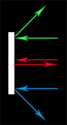

# Pong Game Mechanics
## Genre
- Arcade · Sports

## How to start a game

### 1. Logged Game
- 1.1 Log in to your account.
- 1.2 Click on "Play" in the main menu.
- 1.3 Choose "Single Player" to play against the AI or "Multiplayer" to invite a friend.
- 1.4 For multiplayer, select a friend from your friends list or enter their username to invite them.
- 1.5 Once both players are ready, the game will start.

### 2. Guest Game
- 2.1 Click on "Play as Guest" in the main menu.
- 2.2 Choose "Single Player" to play against the AI.

## Main Buttons and Controls
### Buttons
- ** Play Now**: Start a new game immediately.
- **Ranking** : View the global leaderboard and your ranking.
- **How to Play**: Access the game rules and controls.

### Controls
- **Move Up**: Press the "W" key (Player 1) or the "Up Arrow" key (Player 2) to move the paddle up.
- **Move Down**: Press the "S" key (Player 1) or the "Down Arrow" key (Player 2) to move the paddle down.
- **Pause/Resume**: Press the "P" key to pause or resume the game.
- **Exit Game**: Press the "Esc" key to exit the current game and return to the main menu.

## Mechanics
- **Paddle Movement**: Players control a paddle that can move vertically to hit the ball.
- **Ball Physics**:
- The ball bounces off the paddles and walls, with variable speeds due to collisions.
- The angle of the ball's trajectory changes based on where it hits the paddle, allowing for strategic play.
- If the ball hits the top or bottom wall, it bounces back into play, while if it passes a paddle, a point is scored for the opposing player.
- If the ball hits the paddle's edge and the paddle is moving, the ball's speed increases, adding an element of skill and strategy to the game. e.g.:
  - If the ball hits the center of the paddle, it bounces back at a standard speed.
  - If the ball hits the edge of the paddle while it's moving, it bounces back at a higher speed, making it more difficult for the opponent to return.
  - If the paddle hits the ball at the top corner, then it should bounce off towards our top border.
  - If the paddle hits the ball at the center, then it should bounce off towards the right, and not up or down at all.
  - If the paddle hits the ball at the bottom corner, then it should bounce off towards our bottom border.
  
  [Pong-Collision-Physics-Reference](https://stackoverflow.com/questions/51979115/pong-game-physics)

  
- **Scoring**: A point is scored when the ball passes the opponent's paddle. The first player to reach 10 points wins the game.
- **Power-ups**:
  - Randomly appearing power-ups can provide temporary advantages, such as increased paddle size or faster ball speed.
  - Players can collect these power-ups by hitting them with the ball.
  - Each power-up has a unique effect that can turn the tide of the game, adding an extra layer of strategy and excitement.
  - The appeared power-up has a cooldown period before it can appear again, ensuring that the game remains balanced and competitive.
- **Power-ups activation**: When a player collects a power-up, it activates immediately and lasts for a limited time, providing a strategic boost to the player who collected it. [Reference](https://aquaset091.itch.io/pong-with-powers)
- **Feedback**: The game provides visual and audio feedback for paddle hits, scoring, and power-up activation to enhance player engagement.
  - Movement Feedback: If the paddle moves fast, it leaves a trail effect to indicate speed.
  - Visual Feedback: When a player hits the ball, the paddle briefly changes color
  - Audio Feedback: Hit sound effect plays to indicate a successful hit.
  - When a point is scored, the scoring player's score flashes, and a celebratory sound effect is triggered.

## Dynamics
- **Competitive Play**: Players compete to outscore their opponent by strategically hitting the ball.
- **AI Difficulty**: The AI opponent adjusts its difficulty based on the player's performance, providing a challenging experience.
- **Multiplayer Interaction**: Players can invite friends for real-time matches, fostering social interaction and competition.
- **Social Engagement Loops**:
  - Live Audience: The bigger live match audience, the more free power-ups are available for the match, creating a feedback loop that encourages players to invite friends and engage with the community.
  - Tournament Progression: Winning matches in tournaments unlocks new customization options and achievements, motivating players to participate in more tournaments.
  - Followers and Spectators: Players can follow their favorite competitors and spectate matches, creating a sense of community and engagement, but also sending 2 points to the followers and winning 1 point to themselves.

## Levels
Levels are based on the player's accumulated points from matches, with each level unlocking new customization options and achievements. Players earn points by winning matches, participating in tournaments, and engaging with the community. The levels are designed to provide a sense of progression and reward players for their dedication and skill in the game.
| Level | Name | Points required |
| :-: | :-: | :-: |
| 1 | Fresh Meat | 0 |
| 2 | New Around Here | 10 |
| 3 | Still needs Oil | 30 |
| 4 | Learning the Paddles | 60 |
| 5 | Something to Say | 100 |
| 6 | Know-it-all | 150 |
| 7 | Expert | 300 |
| 8 | Guru | 500 |